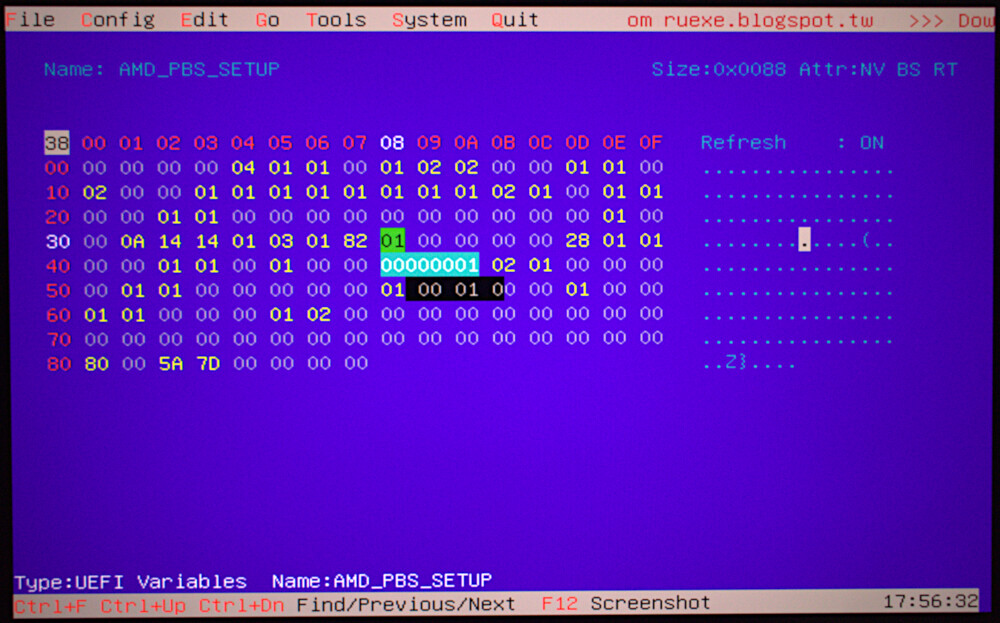
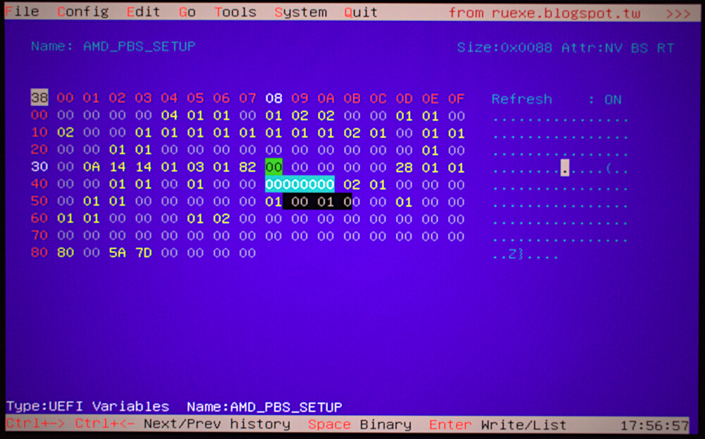
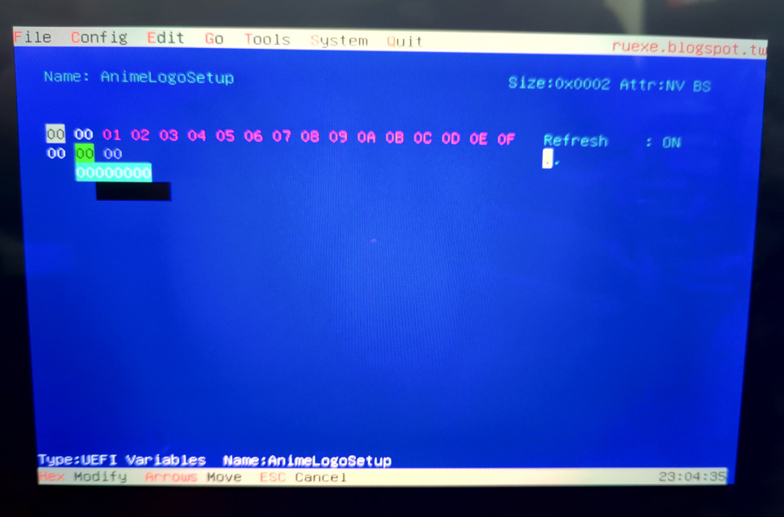

# Arch Linux on Asus Flow X13
Fixes and tweaks for running Arch Linux on the Asus Flow X13 laptop.

## Fix tablet mode
The [linux-asus](https://aur.archlinux.org/packages/linux-asus) kernel contains patches which
enables the `SW_TABLET_MODE` event and disables the keyboard+trackpad when folding the device
into tablet position.

## Enabling S3 by modifying hidden UEFI setting
⚠ While this enables S3, I experience frequent amdgpu driver crashes when resuming from suspend.
Still experiencing this as of kernel 6.0.11. I also experienced the same kind of crash with DSDT patching.

Use [RU.EFI](http://ruexe.blogspot.com/) to modify the following UEFI variable:

**Before**

**After**

## Disabling boot logo animation
Why? It seems to *slightly* speed up boot times (I also despise the cheesy gamer branding).

Use [RU.EFI](http://ruexe.blogspot.com/) to modify the following UEFI variable:

